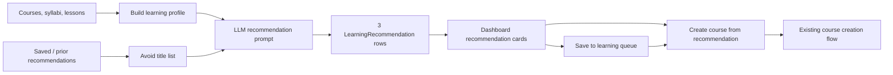

# Bloom Architecture

## Purpose

Bloom is a personal adaptive learning system. The web app stores courses, syllabi, lessons, annotations, feedback, learning events, and recommendation candidates in SQLite through a FastAPI backend. The React frontend exposes the learning workflow in the browser.

## Runtime Layout

```text
frontend/               React + Vite browser app
  src/pages/            Route-level pages
  src/components/       Reusable reading and recommendation components
  src/lib/api.js        Typed-by-convention API client

backend/                FastAPI service
  app/main.py           App creation, CORS, routers, static frontend mount
  app/courses.py        Course, lesson, annotation, feedback, stats, summary APIs
  app/recommendations.py Recommendation refresh, save, remove, start APIs
  app/models.py         SQLAlchemy models
  app/schemas.py        Pydantic request and response schemas
  app/database.py       SQLite engine, session factory, schema compatibility
```

## Core Data Model

### Learning Flow

- `Course`: one learning topic or source-reading course.
- `Syllabus`: one generated mastery checklist per course.
- `Lesson`: numbered course articles. `number=0` stores the final summary.
- `Annotation`: highlight Q&A sessions inside a lesson or source material.
- `Feedback`: learner feedback and thought-question answers per lesson.
- `LearningEvent`: append-only activity events used for stats and streaks.

### Recommendation Flow

- `LearningRecommendation`: a candidate next topic generated from the full learning record.
- `status="suggested"`: visible in the current 3-topic recommendation set.
- `status="saved"`: stored in the待学习清单.
- `status="started"`: the user created a real course from this recommendation.
- `status="dismissed"`: replaced by refresh or removed from the saved list.

## Recommendation Data Flow



`POST /api/recommendations/refresh` generates a new set of 3 recommendations. Existing `suggested` rows become `dismissed`, while `saved` rows remain in the待学习清单.

When the frontend starts a recommendation, it calls the existing `POST /api/courses` endpoint with the recommendation title plus rationale as reference material, then marks the recommendation as `started` through `POST /api/recommendations/{id}/start`.

## API Boundaries

Course generation remains owned by `app/courses.py`. Recommendation APIs never create lessons directly and never mutate syllabus progress. This keeps "candidate learning intent" separate from "actual learning record".

## Testing Strategy

- Backend unit tests use in-memory SQLite and mocked LLM calls.
- Recommendation tests cover refresh, save, remove, refresh replacement, and start-link behavior.
- Frontend verification uses `npm run lint` and `npm run build`.
- End-to-end manual verification should open the dashboard, refresh recommendations, save a topic, and start a topic into the course flow.
