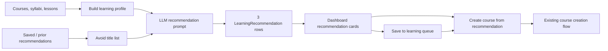

# Bloom Architecture

## Purpose

Bloom is a personal adaptive learning system. The web app stores courses, syllabi, lessons, annotations, feedback, learning events, and recommendation candidates in SQLite through a FastAPI backend. The React frontend exposes the learning workflow in the browser.

## Runtime Layout

```text
frontend/               React + Vite browser app
  src/pages/            Route-level pages
  src/components/       Reusable reading and recommendation components
  src/lib/api.js        Typed-by-convention API client

backend/                FastAPI service
  app/main.py           App creation, CORS, routers, static frontend mount
  app/courses.py        Course, lesson, annotation, feedback, stats, summary APIs
  app/recommendations.py Recommendation refresh, save, remove, start APIs
  app/models.py         SQLAlchemy models
  app/schemas.py        Pydantic request and response schemas
  app/database.py       SQLite engine, session factory, schema compatibility

skills/bloom-tutor/     Markdown-first CLI learning workflow used by coding agents
```

## Course Creation Flow

Topic course creation starts in `frontend/src/pages/DashboardPage.jsx`.

1. The user enters a topic, optional reference material, and a learning depth.
2. `frontend/src/lib/api.js#createCourse` sends `name`, `reference`, and `learning_depth` to `POST /api/courses`.
3. `backend/app/schemas.py#CreateCourseRequest` validates `learning_depth` as one of `simple`, `standard`, or `deep`.
4. `backend/app/courses.py#create_course` injects the selected depth into `SYLLABUS_PROMPT`.
5. The LLM returns markdown syllabus content, which is stored in `syllabi.content`.
6. The first lesson prompt receives the generated syllabus, so lesson depth follows the syllabus rather than a separate database field.

Source course creation follows the same depth path through `createSourceCourse` and `POST /api/courses/from-source`, but the first lesson remains the uploaded source-reading chapter.

## Learning Depth

Depth is a generation parameter, not persistent course metadata.

- `simple`: 2-3 modules, 8-10 mastery items, focused on the core trunk and high-frequency use cases.
- `standard`: 3-4 modules, 10-12 mastery items, balanced coverage of concepts, reasoning, applications, and misconceptions.
- `deep`: 4-5 modules, 12-15 mastery items, including first principles, mechanisms, boundaries, counterexamples, and transfer judgment.

The selected depth is written into the generated syllabus markdown as visible text. From that point onward, the syllabus remains the single source of truth for course progression. No migration is needed because depth does not require a new column.

## Core Data Model

`backend/app/models.py` defines:

### Learning Flow

- `Course`: one learning topic or source-reading course, with mode, status, and optional source file metadata.
- `Syllabus`: one generated mastery checklist per course, stored as markdown.
- `Lesson`: numbered course articles. `number=0` stores the final summary.
- `Annotation`: highlight Q&A sessions inside a lesson or source material.
- `Feedback`: learner feedback and thought-question answers per lesson.
- `LearningEvent`: append-only activity events used for course/global stats and streaks.

### Recommendation Flow

- `LearningRecommendation`: a candidate next topic generated from the full learning record.
- `status="suggested"`: visible in the current 3-topic recommendation set.
- `status="saved"`: stored in the待学习清单.
- `status="started"`: the user created a real course from this recommendation.
- `status="dismissed"`: replaced by refresh or removed from the saved list.

## Recommendation Data Flow



`POST /api/recommendations/refresh` generates a new set of 3 recommendations. Existing `suggested` rows become `dismissed`, while `saved` rows remain in the待学习清单.

When the frontend starts a recommendation, it calls the existing `POST /api/courses` endpoint with the recommendation title plus rationale as reference material, then marks the recommendation as `started` through `POST /api/recommendations/{id}/start`.

## API Boundaries

Course generation remains owned by `app/courses.py`. Recommendation APIs never create lessons directly and never mutate syllabus progress. This keeps "candidate learning intent" separate from "actual learning record".

## Personal Center & Learning Calendar

`GET /api/calendar` aggregates `LearningEvent` rows (joined to `Course`) into per-day activity for the profile page. Each day reports the courses touched, their lesson numbers, and a highlight count.

- Day grouping uses the **server local date** via `_event_local_date` in `app/courses.py`: stored timestamps are UTC, so they are converted to local time before taking the date. The `/stats` streak computation calls the same helper, so streaks and the calendar share one basis and early-morning study is no longer attributed to the previous UTC day.
- Highlight counts come from `Annotation` rows (by `created_at`), not `annotation_answered` events, so follow-up turns are never double-counted and the per-day totals sum to `/stats` `total_annotations`.

The frontend route `/profile` (`frontend/src/pages/ProfilePage.jsx`) renders overview stat cards, a month calendar shaded by daily activity (clicking a day reveals that day's courses, lessons, and highlights), and a six-month contribution heatmap. The dashboard header links to it.

## Verification

Backend tests live in `backend/tests/` and run with:

```bash
cd backend && uv run pytest tests/
```

Frontend build verification runs with:

```bash
cd frontend && npm run build
```

Backend unit tests use in-memory SQLite and mocked LLM calls. Recommendation tests cover refresh, save, remove, refresh replacement, and start-link behavior. End-to-end manual verification should open the dashboard, refresh recommendations, save a topic, and start a topic into the course flow.
